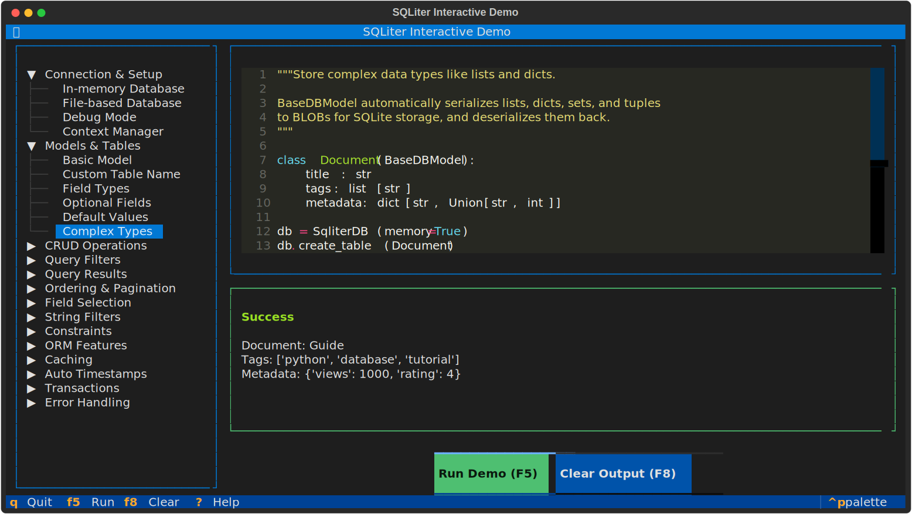

# SQLiter Interactive Demo



The **SQLiter Interactive Demo** is a terminal-based Textual TUI application that provides a hands-on, interactive way to explore SQLiter's features. Through a collection of runnable code examples, you can learn how to use SQLiter effectively without writing any code yourself.

## Features

- **Interactive Demo Browser**: Navigate through categorized demo examples using an intuitive tree view
- **Live Code Display**: View the complete source code for each demo with syntax highlighting
- **One-Click Execution**: Run demos directly within the TUI and see real output
- **Organized Categories**: Demos are grouped by feature area for easy exploration
- **Vim-Style Navigation**: Support for j/k keys for navigation (in addition to arrow keys)

## Installation

The TUI demo is included with SQLiter when you install it with the optional
`demo` (or `full`) extra:

With uv:

```bash
uv add sqliter-py[demo]
```

Or if you are using pip:

```bash
pip install sqliter-py[demo]
```

## Running the Demo

To start the interactive TUI demo, simply run:

```bash
python -m sqliter.tui
```

Or if you have SQLiter installed:

```bash
sqliter-demo
```

## Navigation

### Keyboard Shortcuts

| Key | Action |
|-----|--------|
| `Up` / `Down` or `j` / `k` | Navigate demo list |
| `Left` / `Right` or `h` / `l` | Collapse/expand category |
| `Enter` | Select demo to view code |
| `F5` | Run selected demo |
| `F8` | Clear output panel |
| `Tab` | Move focus between panels |
| `?` or `F1` | Show help screen |
| `q` | Quit application |

### Mouse Support

- Click on categories to expand/collapse them
- Click on demo names to select and view their code
- Click the "Run Demo" button to execute the selected demo
- Click the "Clear Output" button to clear the output panel

## Demo Categories

The demos are organized into the following categories (in the order they appear in the TUI):

### [Connection & Setup](connection.md)

Learn different ways to connect to SQLite databases, including in-memory and file-based databases.

### [Models & Tables](models.md)

Understand how to define Pydantic models for your database tables, including field types and constraints.

### [CRUD Operations](crud.md)

Basic Create, Read, Update, and Delete operations for managing your data.

### [Query Filters](filters.md)

Query your data using various filter operators like equals, greater than, less than, and more.

### [Query Results](results.md)

Different ways to fetch results: single records, all records, or using pagination.

### [Ordering & Pagination](ordering.md)

Sort your query results and use limit/offset for pagination.

### [Field Selection](field-selection.md)

Control which fields are returned in your queries to optimize performance.

### [String Filters](string-filters.md)

Special filtering options for string fields, including starts with, ends with, and contains.

### [Constraints](constraints.md)

Define database constraints like unique fields and foreign key relationships.

### [ORM Features](orm.md)

Advanced ORM features including foreign keys, lazy loading, and reverse relationships.

### [Caching](caching.md)

Improve performance by caching query results with TTL (Time To Live) support.

### [Auto Timestamps](timestamps.md)

Automatically track when records are created and last modified.

### [Transactions](transactions.md)

Group multiple operations into atomic transactions for data consistency.

### [Error Handling](errors.md)

Understand common errors and how to handle them properly.

## Tips for Learning

1. **Start with Connection and Models**: Before diving into queries, understand how to connect to databases and define your data models.
2. **Read the Code First**: Each demo displays the complete source code - read it before running to understand what will happen.
3. **Experiment**: After running a demo, think about how you might modify it for your use case.
4. **Follow the Flow**: The categories are ordered from basic to advanced - follow them in sequence for the best learning experience.
5. **Check the Output**: The output panel shows real results - pay attention to what's returned and how it's formatted.

## Next Steps

After exploring the interactive demo, check out the [Guide](../guide/guide.md) for detailed documentation on each topic.

!!! tip
    The interactive demo is also a great way to quickly look up syntax - just find the demo that matches what you want to do, and copy the code pattern!
